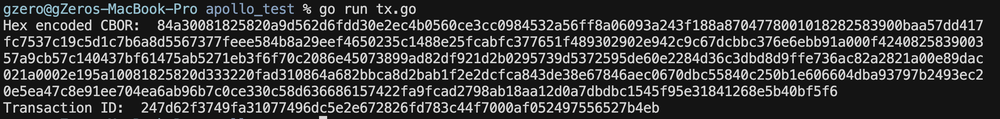

# SLT 102.2: I Can Build a Simple Transaction with Apollo

In this lesson, you will build, sign, and submit a simple ADA transaction on Cardano using Apollo. This is your first hands-on experience turning transaction intent into a real ledger event.

Apollo is a Go library that makes Cardano transaction building accessible. Rather than manually constructing CBOR-encoded transactions, Apollo provides a fluent builder pattern that handles UTxO selection, fee calculation, and change output generation automatically.

By the end of this lesson, you will have submitted a transaction to Cardano preprod and verified it on a block explorer.

---

## Prerequisites

Before you begin, ensure you have:

- Go 1.21+ installed
- A [Blockfrost](https://blockfrost.io/) API key (free tier works for this lesson)
- A Cardano preprod testnet wallet funded with test ADA - both mnemonics and address (created in previous lesson)
- A basic understanding of the Cardano UTxO model
- Completed **SLT 100.4 – Apollo: Background and Purpose**

> **Note on infrastructure:** You do **not** need to run a local Cardano node for this lesson. Apollo can query the chain and submit transactions via hosted services like Blockfrost. Running a local node is an option explored later in the course.

---

## What You Are Building

You will build a program that:

- Connects to the Cardano Preprod network through Blockfrost apis
- Loads a wallet from a mnemonic  
- Queries UTxOs for that wallet  
- Constructs a transaction that sends ADA  
- Automatically balances inputs and change  
- Signs the transaction  
- Submits it to the network

This lesson focuses on **single-signer, ADA-only transactions**.

---

## Minimal Go Setup To Run a Simple Apollo Transaction

Treat the setup and the example as one sequence. You will copy the example into `tx.go`, add your `.env` values, initialize the module, install dependencies, and run.

### 1) Create a project folder and files

```bash
mkdir apollo_test && cd apollo_test
touch tx.go .env
```

### 2) Add the example code to `tx.go`

Copy the full example below into `tx.go`.

### 3) Set required environment variables in `.env`

The example uses `godotenv.Load()`, so put values in `.env`:

```env
BLOCKFROST_API_KEY="your_blockfrost_api_key"
WALLET_MNEMONIC="your mnemonic words here"
RECIPIENT_ADDRESS="addr_test1..."
```

### 4) Initialize the Go module

```bash
go mod init apollo_test
```

`go mod init` creates a `go.mod` file, which tells Go this folder is a module and records its module name.

### 5) Install dependencies

```bash
go mod tidy
```

`go mod tidy` reads imports from your code, downloads required packages, and updates `go.mod` and `go.sum`.

### 6) Run

```bash
go run ./tx.go
```

## Example: Simple ADA Transfer (`tx.go`)

Below is a complete example. You do not need to understand every line yet—focus on the overall structure and flow.

```go
package main

import (
	"encoding/hex"
	"fmt"
	"log"
	"os"

	"github.com/Salvionied/apollo"
	"github.com/Salvionied/apollo/constants"
	"github.com/Salvionied/apollo/txBuilding/Backend/BlockFrostChainContext"
	"github.com/fxamacker/cbor/v2"
	"github.com/joho/godotenv" // Needed
)

func main() {
	// ---- 1) Connect (ChainContext) ----
	if err := godotenv.Load(); err != nil {
		log.Printf("warning: could not load .env file: %v", err)
	}

	blockfrostAPIKey := requiredEnv("BLOCKFROST_API_KEY")
	seed := requiredEnv("WALLET_MNEMONIC")
	recipient := requiredEnv("RECIPIENT_ADDRESS")

	bfc, err := BlockFrostChainContext.NewBlockfrostChainContext(
		constants.BLOCKFROST_BASE_URL_PREPROD, 
		int(constants.PREPROD),                
		blockfrostAPIKey,
	)
	if err != nil {
		log.Fatal(err)
	}

	// ---- 2) Load wallet ----
	cc := apollo.NewEmptyBackend()
	apollob := apollo.New(&cc)

	apollob, err = apollob.SetWalletFromMnemonic(seed, constants.PREPROD) 
	if err != nil {
		log.Fatal(err)
	}

	apollob, err = apollob.SetWalletAsChangeAddress() 
	if err != nil {
		log.Fatal(err)
	}
	// fmt.Println(apollob.GetWallet().GetAddress()) // Print wallet address

	// ---- 3) Fetch UTxOs ----
	utxos, err := bfc.Utxos(*apollob.GetWallet().GetAddress())
	if err != nil {
		log.Fatal(err)
	}
	// fmt.Println(bfc.Utxos(*apollob.GetWallet().GetAddress()))

	// ---- 4) Declare intent + 5) Complete (balance) ----
	apollob, _, err = apollob.AddLoadedUTxOs(utxos...).PayToAddressBech32(recipient, 1_000_000).Complete()
	if err != nil {
		log.Fatal(err)
	}

	// ---- 6) Sign ----
	apollob = apollob.Sign()
	tx := apollob.GetTx()

	cborred, err := cbor.Marshal(tx)
	if err != nil {
		log.Fatal(err)
	}
	fmt.Println("Hex encoded CBOR: ", hex.EncodeToString(cborred))

	// ---- 7) Submit ----
	txID, err := bfc.SubmitTx(*tx)
	if err != nil {
		log.Fatal(err)
	}
	fmt.Println("Transaction ID: ", hex.EncodeToString(txID.Payload))
}

func requiredEnv(key string) string {
	value := os.Getenv(key)
	if value == "" {
		log.Fatalf("missing required env var: %s", key)
	}
	return value
}

```

---
### The transaction succeeded if you see something like this:


---

## Transaction Lifecycle

Cardano transactions follow typical patterns. This pattern is:

1. Connect (ChainContext)  
2. Load wallet  
3. Fetch UTxOs  
4. Declare intent  
5. Complete (balance)  
6. Sign  
7. Submit  

| Lifecycle Step | Where It Happens |
|----------------|-----------------|
| Connect | `NewBlockfrostChainContext(...)` |
| Load wallet | `SetWalletFromMnemonic(...)` |
| Fetch UTxOs | `bfc.Utxos(...)` |
| Declare intent | `AddLoadedUTxOs()`, `PayToAddressBech32()` |
| Finalize | `Complete()` |
| Sign | `apollob.Sign()` |
| Submit | `bfc.SubmitTx()` |

---

## Verifying Your Transaction

After submission, copy the transaction hash and view it on a block explorer:

- [https://preprod.cardanoscan.io/](https://preprod.cardanoscan.io/)

You should see:

- Inputs consumed
- Outputs created
- Fees paid

---

## What This Example Does Not Cover

To keep the lesson focused, this example does not include:

- Multi-signature transactions
- Native assets or tokens
- Smart contract interactions
- Custom fee logic

These will be introduced in later lessons.

---

## Common Errors

- **Insufficient funds**: Ensure your wallet has enough test ADA
- **Wrong network**: Your Blockfrost key must match the network
- **Pending UTxOs**: Wait for previous transactions to confirm

---

## Summary

- You built a real Cardano transaction in Go
- Apollo handled UTxO selection and fee calculation
- You signed and submitted the transaction
- You verified the result on-chain

This pattern is the foundation for every transaction you will build in this course.
